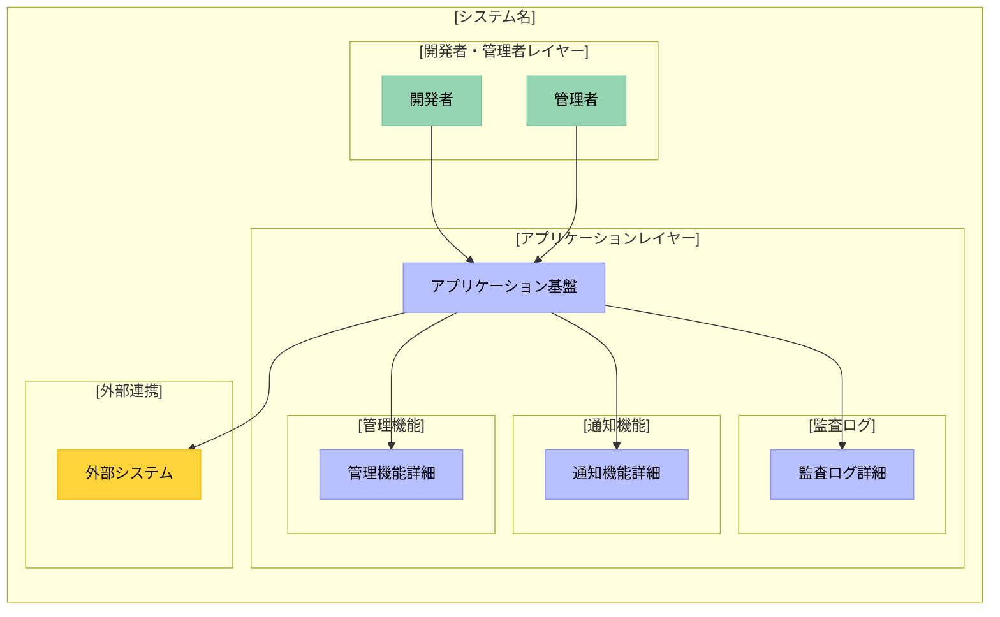
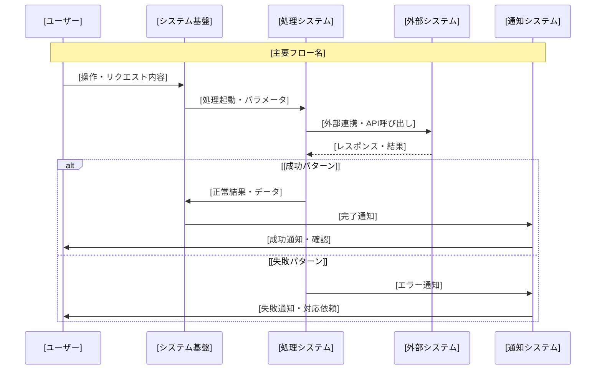

# /create-requirements

**Command Type**: System Architecture Requirements Generator  
**Domain**: IT Consulting Projects  
**Purpose**: 全体システム構成設計書の高品質自動生成

## Overview

ITコンサルティングプロジェクト向けの要件定義書を高品質に自動生成する汎用コマンド。提案書から技術実装レベルの詳細な要件定義書を生成し、実装可能な設計書を出力します。

**重要な改善点**: 要件定義書を作成する前に、すべての不明点をユーザーに確認し、完全に解消してから高品質なドキュメントを生成します。これにより、手戻りを防ぎ、より正確で実装可能な要件定義書を作成できます。

## Usage Syntax

```bash
/create-requirements <proposal_path> [deliverables_path]
```

## Input Specifications

### Required Parameters

| Parameter | Type | Description | Validation | Example |
|-----------|------|-------------|------------|----------|
| `proposal_path` | File Path | 顧客提案書のファイルパス<br/>- Format: Markdown (.md)<br/>- Content: プロジェクト概要・要件・技術情報 | Path exists, readable | `docs/prj-summary.md` |

### Optional Parameters  

| Parameter | Type | Description | Default | Example |
|-----------|------|-------------|---------|----------|
| `deliverables_path` | File Path | 作成予定ドキュメント一覧のパス<br/>- Format: Markdown (.md)<br/>- Content: 関連文書リスト | None | `docs/作成予定ドキュメント一覧.md` |

## Processing Algorithm

### Core Processing Flow

#### 1. 入力分析 (Input Analysis)
- **提案書解析**: マークダウンファイルの構造・内容解析
- **プロジェクト情報抽出**: 背景・課題・目標・制約条件の特定  
- **プロジェクト識別**: 年月-番号-プロジェクト名・組織名パターンの抽出
- **不明点・曖昧点の検出**: 提案書から読み取れない重要情報の特定

#### 2. ユーザー確認フェーズ (User Confirmation Phase) 🆕
**重要**: このフェーズでは、要件定義書の品質を確保するため、すべての不明点を事前に解消します。

##### 2.1 確認事項の抽出と分類
- **必須確認事項**: 要件定義書作成に不可欠な情報
- **推奨確認事項**: より詳細で実装しやすい設計のための情報
- **オプション確認事項**: 将来的な拡張性や運用を考慮した情報

##### 2.2 確認プロンプトの生成
**動的生成方式**: 提案書の内容を分析し、不足情報や曖昧な点を特定して、プロジェクト固有の確認事項を動的に生成

###### 基本的な確認フレームワーク
以下は参考となる確認カテゴリ。実際の確認事項は提案書の内容に基づいて動的に生成される：

1. **プロジェクト基本情報の確認**
   - 提案書から読み取れない基本情報を抽出
   - 例：プロジェクト名、組織名、期間、体制など

2. **技術的詳細の確認**
   - 提案書で言及されているが詳細不明な技術要素
   - 例：「クラウド活用」→ 具体的なプラットフォーム、サービス

3. **非機能要件の具体化**
   - 抽象的に記載されている要件の数値化
   - 例：「高可用性」→ 具体的なSLA目標値

4. **統合・連携の詳細**
   - 言及されているが詳細不明な外部システムとの関係
   - 例：「既存システムと連携」→ 具体的なシステム名、API仕様

5. **運用・保守の具体化**
   - 運用に関する言及がある場合の詳細確認
   - 例：「24時間監視」→ 監視体制、エスカレーション

###### 動的質問生成のプロセス
1. **提案書のキーワード分析**
   - 技術用語、システム名、要件記述を抽出
   - 曖昧な表現（「最適な」「効率的な」「高性能な」等）を検出

2. **コンテキストに基づく質問生成**
   - 検出された曖昧な点について具体的な質問を生成
   - 提案書に記載がない必須情報について質問を追加

3. **優先度付け**
   - 必須：要件定義書作成に不可欠な情報
   - 推奨：より詳細な設計のための情報
   - オプション：将来的な拡張性のための情報

4. **提案書固有の不明点の抽出**
   - 提案書の文脈から読み取れない重要情報
   - 矛盾する可能性のある要件の明確化
   - 実装上のリスクとなり得る曖昧な記述の詳細化

5. **プロジェクトリスクの包括的な洗い出し** 🆕
   - 技術的な実現可能性の不明確な要素
   - ビジネス要件の曖昧さや変更可能性
   - リソース・体制・スケジュールの不確実性
   - 外部要因や依存関係による不明点

###### リスク確認のための質問項目（必須）
以下のリスク関連質問は必ず確認フェーズで行う：

1. **技術的な懸念事項**
   - 「実現可能性に不安がある技術要件はありますか？」
   - 「過去に類似システムで問題となった技術課題はありますか？」
   - 「新しい技術や未検証の技術を採用する予定はありますか？」

2. **ビジネス要件の不明点**
   - 「要件が明確でない、または変更される可能性がある機能はありますか？」
   - 「ステークホルダー間で合意が取れていない要件はありますか？」
   - 「優先順位が不明確な機能はありますか？」

3. **リソース・体制の不確実性**
   - 「必要なスキルセットを持つ人材の確保に不安はありますか？」
   - 「開発期間中のメンバー変更リスクはありますか？」
   - 「予算やスケジュールに制約や不確実性はありますか？」

4. **統合・連携リスク**
   - 「既存システムとの連携で懸念される点はありますか？」
   - 「外部APIやサービスの制約事項はありますか？」
   - 「データ移行や変換で複雑な処理が必要な箇所はありますか？」

5. **性能・スケーラビリティ**
   - 「性能要件を満たせるか不安な処理はありますか？」
   - 「将来的な負荷増大で懸念される箇所はありますか？」
   - 「リアルタイム処理で技術的制約が予想される部分はありますか？」

6. **外部要因・依存関係**
   - 「外部ベンダーや協力会社への依存で懸念事項はありますか？」
   - 「法規制やコンプライアンス要件で不明確な部分はありますか？」
   - 「組織変更や方針転換のリスクはありますか？」

7. **プロトタイプ推奨領域**
   - 「事前検証（PoC）が必要と考える機能はありますか？」
   - 「段階的実装を検討している機能はありますか？」
   - 「代替案を準備すべき機能はありますか？」

##### 2.3 ユーザー回答の待機と処理
- ユーザーに確認事項を提示し、回答を待つ
- 回答が不十分な場合は追加質問を行う
- すべての必須確認事項が解消されるまで次のステップに進まない

##### 2.4 確認完了条件
- すべての必須確認事項に回答が得られている
- 技術的な矛盾や実現不可能な要件がない
- ユーザーが確認内容に合意している

#### 3. 技術設計 (Technical Design)
- **実装レベル詳細化**: 抽象的要件を具体的実装仕様に変換
- **API/パラメータ具体化**: 使用技術・設定値・環境情報の明示
- **既存システム依存関係把握**: 統合ポイント・制約・影響範囲の分析
- **ユーザー確認内容の反映**: 確認フェーズで得た情報を設計に組み込む

#### 4. 要件設計 (Requirements Design)  
- **システム特性分析**: 処理特性・アクセスパターン・負荷特性の評価
- **現実的非機能要件**: 性能・可用性・セキュリティ要件の具体化
- **通知/監査機能詳細化**: コンプライアンス・運用要件の実装詳細
- **確認済み要件の検証**: ユーザー確認内容との整合性チェック

#### 5. 視覚化 (Visualization)
- **実装レベルMermaid図**: システム構成・コンポーネント関係図
- **シーケンス図**: データフロー・処理シーケンスの表現
- **サブシステム表現**: 責任分界・統合ポイントの明示

#### 6. 品質保証 (Quality Assurance)
- **技術的不確実性明記**: 検証が必要な項目の明確化
- **実装可能性検証**: 技術的制約・リスクの評価
- **文書品質チェック**: 完全性・正確性・一貫性の確認
- **ユーザー確認内容との照合**: 確認事項が正しく反映されているか検証

## Output Template Specification

### Document Structure Overview

The generated document follows this standardized structure:

```markdown
# [年月-番号-プロジェクト名]/01_要件定義/全体システム構成設計書

[Backlog Wiki Link](https://cm1.backlog.jp/alias/wiki/[ID])

## 1. 目的

本設計書は、[組織名]における[プロジェクト名]の全体システム構成を定義し、[主要目標]の実現に向けた技術的アーキテクチャを明示するものです。

### 1.1 プロジェクト概要
[プロジェクトの背景・課題・新アプローチの説明]

### 1.2 ビジネス要件と技術要件のバランス
[開発者体験・セキュリティ・運用コストの最適化方針]

### 1.3 関連文書への参照
**関連文書**: [関連する要件定義書がある場合の具体的参照]
- 「[関連文書タイトル](./関連文書ファイル名.md)」

## 2. 機能要件

### 2.1 [コア機能名1]
- **[サブ機能1名]**: [具体的な機能説明、実行条件、タイミング] + [具体的ツールチェーン]
- **[サブ機能2名]**: [具体的な機能説明、実行条件、タイミング] + [具体的ツールチェーン]
- **[サブ機能3名]**: [関連機能説明] + [具体的ツール名]
- **[サブ機能4名]**: [関連機能説明] + [具体的実行環境・ツール]

### 2.2 [コア機能名2]
- **[サブ機能1名]**: [具体的な機能説明] + [具体的ポリシー・設定]
- **[サブ機能2名]**: [具体的な機能説明] + [具体的API・プロセス]

### 2.3 [コア機能名3]
- **[サブ機能1名]**: [申請・検証・登録プロセス説明] + [具体的API・ツール]
- **[サブ機能2名]**: [管理項目詳細] + [具体的設定ファイル形式]
- **[サブ機能3名]**: [管理方式、権限制御] + [具体的ツール・設定]

### 2.4 通知機能
- **[通知タイプ1名]**: [トリガー条件、段階的通知方式] + [具体的通知チャネル・ツール]
- **[通知タイプ2名]**: [トリガー条件、即座通知方式] + [具体的通知方式・機能]
- **[通知タイプ3名]**: [トリガー条件、確認通知] + [具体的通知方式・確認方法]
- **[通知タイプ4名]**: [トリガー条件、監視通知] + [具体的通知機能・ツール]
- **[通知タイプ5名]**: [トリガー条件、緊急通知] + [複数チャネル通知方式・ツール]

### 2.5 権限管理機能
- **[アクセス制御機能名]**: [グループ・ロール別アクセス制御] + [具体的権限制御ツール・設定]
- **[ワークフロー保護機能名]**: [管理権限者限定編集機能] + [具体的保護設定・ツール]
- **[ブランチ保護機能名]**: [変更制限・レビュー必須化] + [具体的設定・ツール]
- **[レビュー・承認機能名]**: [承認フロー・ステータスチェック必須化] + [具体的設定・ツール]
- **[管理者権限機能名]**: [管理チームメンバー限定権限] + [具体的権限管理ツール]

### 2.6 監査・ログ機能
- **監査ログ**: [ログ種別] + [記録内容] + [保存先]
- **イベント記録**: [記録対象イベント] + [ログ形式] + [保持期間]
- **コンプライアンス対応**: [準拠規格] + [監査要件対応方法]

## 3. 非機能要件

### 3.1 性能要件

本システムは以下の特性により、[性能要件定義方針を記載]

#### 3.1.1 システム特性
- **[処理特性1]**: [バッチ処理中心/リアルタイム処理/非同期処理等のシステム特性]
- **[処理特性2]**: [アクセス頻度特性/処理量特性/同時実行特性等]
- **[許容特性]**: [待機時間許容度] + [品質と処理時間の優先度関係]

#### 3.1.2 性能管理方針
- **[管理方針1]**: [処理完了通知等による開発者体験の確保方針]
- **[管理方針2]**: [リソース監視とボトルネック特定方針]
- **[管理方針3]**: [ユーザーフィードバックに基づく継続改善方針]
- **[管理方針4]**: [運用開始後の実績に基づく要件設定方針]

### 3.2 可用性要件

#### 3.2.1 システム可用性方針
本システムは[依存するサービス群]に依存するため、各サービスの可用性に準拠する

- **[依存サービス1]**: [サービスの可用性SLAに準拠]
- **[依存サービス2]**: [サービスの可用性SLAに準拠]
- **[依存サービス3]**: [サービスの可用性SLAに準拠]

#### 3.2.2 運用体制
- **基盤インフラ監視**: [既存監視体制への依存方針]
- **システム運用保守**: [担当チームが以下を担当]
  - [システム固有機能1の監視・対応]
  - [システム固有機能2の運用保守]
  - [システム固有機能3の運用保守]
  - [システム固有エラーの監視・対応]
- **障害時対応**: [基盤サービス障害時は依存サービス復旧を待つ、システム固有障害時は担当チームが対応]

### 3.3 セキュリティ要件

#### 3.3.1 認証・認可
- **[認証システム]認証**: 既存の[認証システム名]に依存
- **[権限管理システム]認証**: 既存の[権限管理チーム]が提供する[認証手段]に依存

#### 3.3.2 データ保護
- **[データ暗号化]**: [暗号化サービス/システム]による[対象データ]の暗号化
- **[プラットフォーム保護]**: [プラットフォーム名]の標準的なデータ保護に依存
- **シークレット管理**: [シークレット管理システム1]/[シークレット管理システム2]による機密情報管理
- **アクセス制御**: [対象ログ]へのアクセスは既存認証システムに依存（上記、3.3.1 認証・認可を参照）

### 3.4 スケーラビリティ要件

本システムは主に[マネージドサービス群]を使用するため、スケーラビリティは各サービスに依存する

#### 3.4.1 スケーラビリティ対応
- **[サービス群]**: [マネージドサービス]の自動スケーリングに依存
- **[特定システム機能]**: [具体的なスケーリング設定項目]による[並列処理数調整]と[リソース制限調整]

### 3.5 運用性要件

#### 3.5.1 保守性
- **Infrastructure as Code**: [IaCツール]による設定管理
- **設定変更**: [プラットフォーム]にて上記[IaCツール]コードの変更管理を行う

### 3.6 コンプライアンス要件

#### 3.6.1 監査ログ機能
- 全ての操作イベントを自動的に記録し、監査要件に対応する
- 詳細なログ記録方式は下記「4.4 監査ログ実装詳細」を参照

## 4. 全体システム構成

### 4.1 システム構成概要

本システムは、機能要件・非機能要件に基づき、以下のコンポーネントで構成されます。



### 4.2 コンポーネント別役割

#### 4.2.1 [開発者・管理者レイヤー]
- **開発者**: [役割・操作内容・使用ツール・責任範囲]
- **管理者**: [管理業務・権限・監視運用・エスカレーション対応]

#### 4.2.2 [アプリケーションレイヤー]
- **[基盤システム名]**: [認証・基本機能・既存システム依存・運用体制]
- **[管理機能名]**: [管理機能・権限制御・承認フロー・自動化範囲]

### 4.3 通知機能実装詳細

#### 4.3.1 [通知種別1]実装
- **実装方式**: [通知技術] + [トリガー設定] + [配信方法]
- **通知タイミング**: [具体的タイミング] + [段階的通知]
- **通知先**: [設定ファイル参照] + [送信先管理]
- **注意事項**: [技術的制約] + [詳細検証が必要な機能]

#### 4.3.2 [通知種別2]実装
- **実装方式**: [通知技術] + [イベント検知] + [即時配信]
- **通知先**: [自動決定ロジック] + [設定調整]
- **メリット**: [設定不要] + [確実性・即時性]
- **注意事項**: [機能制限] + [詳細検証が必要な範囲]

### 4.4 監査ログ実装詳細

#### 4.4.1 [ログ種別1]
- **実装方式**: [ログ記録技術] + [変更履歴管理]
- **記録内容**: [対象・変更内容] + [メタデータ]
- **保存場所**: [保存システム] + [永続性]
- **改ざん対策**: [技術的保護措置] + [制限事項・追加対策必要性]
- **注意事項**: [技術的制約] + [厳密な監査要件時の検討事項]

#### 4.4.2 [ログ種別2]
- **実装方式**: [複数システム連携] + [ログ統合管理]
- **記録内容**: [実行ログ・結果] + [タイムスタンプ・実行者]
- **保存場所**: [保存システム1: 保持期間] + [保存システム2: 保持期間]
- **推奨**: [監査要件に応じた保持期間延長検討]

### 4.5 データフロー詳細



### 4.6 実装詳細

#### 4.6.1 [主要機能名]実装詳細
- **実装方式**: [技術実装] + [設定管理] + [外部依存関係]
- **設定・パラメータ**: [設定項目: 設定値・説明・制限事項]
- **メリット**: [実装方式の利点] + [運用・保守面の利点]
- **注意事項**: [技術的制約・依存関係] + [詳細検証が必要な項目]

## 5. プロジェクトを進めるうえでのリスク 🆕

本セクションでは、プロジェクト遂行上のあらゆるリスクと対策を明示し、事前対策やプロトタイプ検証が必要な領域を特定します。

### 5.1 技術的リスク

#### 5.1.1 実現可能性が不明確な要素
- **[技術要素1]**: [実現可能性の懸念事項] + [検証方法]
  - リスクレベル: [高/中/低]
  - 影響範囲: [影響を受ける機能・システム]
  - 対策案: [代替技術・回避策]
  
- **[技術要素2]**: [新技術採用の不確実性] + [学習コスト]
  - リスクレベル: [高/中/低]
  - 影響範囲: [開発期間・保守性への影響]
  - 対策案: [段階的導入・フォールバック計画]

#### 5.1.2 技術的制約事項
- **[制約1]**: [既存技術の限界] + [パフォーマンス上限]
- **[制約2]**: [サードパーティ依存] + [ベンダーロックイン]
- **[制約3]**: [技術的負債] + [将来的な改修コスト]

### 5.2 統合・連携リスク

#### 5.2.1 既存システムとの統合
- **[システム名]との連携**: 
  - リスク: [API仕様の不明確さ/データ形式の不整合]
  - 影響: [データ同期の遅延/不整合]
  - 対策: [中間層の実装/データ変換層の構築]

#### 5.2.2 外部サービス依存
- **[外部サービス名]**: 
  - リスク: [サービス停止/仕様変更]
  - 影響: [機能停止/データ欠損]
  - 対策: [キャッシュ実装/フォールバック処理]

### 5.3 パフォーマンスリスク

#### 5.3.1 性能目標達成の不確実性
- **[処理名]**: 
  - 目標値: [レスポンスタイム/スループット]
  - 懸念点: [ボトルネック箇所]
  - 検証方法: [負荷試験計画]

#### 5.3.2 スケーラビリティの課題
- **[機能名]**: 
  - 予想負荷: [同時接続数/データ量]
  - 懸念点: [リソース制限/コスト増大]
  - 対策: [オートスケーリング設定/最適化]

### 5.4 プロトタイプ検証推奨事項

#### 5.4.1 早期検証が必要な機能（優先度: 高）
| 機能/技術 | 検証目的 | 検証方法 | 必要期間 | 成功基準 |
|---------|--------|---------|---------|---------|
| [機能名1] | [実現可能性確認] | [PoC実装] | [2週間] | [性能目標達成] |
| [機能名2] | [統合動作確認] | [プロトタイプ] | [3週間] | [データ連携成功] |
| [機能名3] | [性能検証] | [負荷試験] | [1週間] | [目標値クリア] |

#### 5.4.2 段階的実装推奨機能（優先度: 中）
- **Phase 1**: [基本機能実装] - [コア機能の動作確認]
- **Phase 2**: [拡張機能追加] - [付加価値機能の実装]
- **Phase 3**: [最適化・改善] - [パフォーマンス改善]

#### 5.4.3 代替案の準備が必要な領域
- **[機能名]**: 
  - プランA: [第一選択の技術・実装方法]
  - プランB: [代替技術・簡易実装]
  - 切り替え判断基準: [期限・コスト・技術的制約]

### 5.5 リスク軽減のための推奨アクション

#### 5.5.1 即時実施事項
1. **技術検証環境の構築**: [検証用インフラの準備]
2. **プロトタイプ開発チームの編成**: [専任メンバーのアサイン]
3. **外部専門家の相談**: [特定技術領域の専門家コンサル]

#### 5.5.2 継続的モニタリング事項
- **週次レビュー**: 技術的課題の早期発見と対策検討
- **リスクログ管理**: 新規リスクの記録と既存リスクの状態更新
- **エスカレーション基準**: リスクレベルに応じた報告体制

### 5.6 ビジネス・要件リスク 🆕

#### 5.6.1 要件の不確実性
- **[要件名]**: 
  - リスク: [要件変更の可能性/スコープクリープ]
  - 影響: [開発期間延長/コスト増大]
  - 対策: [段階的合意形成/プロトタイプによる早期確認]

#### 5.6.2 優先順位の変更リスク
- **ビジネス環境変化**: [市場動向による優先度変更]
- **ステークホルダー調整**: [関係者間の合意形成プロセス]
- **対策**: [MVP定義/コア機能の明確化]

### 5.7 リソース・体制リスク 🆕

#### 5.7.1 人的リソースの不確実性
- **スキル不足**: 
  - リスク: [必要技術の習得期間/専門家不在]
  - 影響: [品質低下/開発遅延]
  - 対策: [研修計画/外部支援/メンタリング体制]

#### 5.7.2 体制変更リスク
- **メンバー離脱**: [キーパーソン依存/引き継ぎリスク]
- **組織再編**: [体制変更による影響]
- **対策**: [ドキュメント化/知識共有/冗長性確保]

### 5.8 外部要因リスク 🆕

#### 5.8.1 外部依存関係
- **ベンダー依存**: 
  - リスク: [納期遅延/品質問題/仕様変更]
  - 影響: [プロジェクト全体への波及]
  - 対策: [SLA締結/複数ベンダー検討/内製化検討]

#### 5.8.2 法規制・コンプライアンス
- **規制変更**: [新規制への対応/既存規制の解釈変更]
- **監査要件**: [追加要件の発生/証跡管理]
- **対策**: [法務確認/余裕を持った設計/専門家相談]

### 5.9 リスク発生時の対応計画

#### 5.9.1 リスク別エスカレーション
- **技術的問題**: [担当者→チームリード→アーキテクト→PM]
- **要件問題**: [担当者→BA→PM→ステークホルダー]
- **リソース問題**: [チームリード→PM→部門長]
- **外部要因**: [PM→ステークホルダー→経営層]

#### 5.9.2 意思決定プロセス
- **継続判断基準**: [コスト・期間・品質のトレードオフ]
- **変更判断基準**: [影響範囲・実現可能性・代替案の有無]
- **中止判断基準**: [ビジネス価値・技術的実現性・リスク許容度]

#### 5.9.3 リカバリー戦略
- **スケジュール調整**: [クリティカルパス最適化/並行作業]
- **スコープ調整**: [機能削減/段階リリース/MVPアプローチ]
- **リソース調整**: [増員/外注活用/優先度変更]

```

### Template Variables

| Variable | Source | Example | Required |
|----------|--------|---------|----------|
| `[年月-番号-プロジェクト名]` | 提案書ファイル名・内容 | `202408-001-Web3TodoApp` | Yes |
| `[組織名]` | 提案書内容 | `株式会社Example` | Yes |
| `[主要目標]` | 提案書の目的・目標セクション | `開発者体験の向上` | Yes |
| `[コア機能名N]` | 提案書の機能要件 | `CI/CD管理機能` | Yes |
| `[サブ機能名]` | 機能詳細 | `自動デプロイ機能` | Yes |
| `[依存サービス群]` | 技術スタック | `AWS Lambda, DynamoDB` | Yes |

## Auto-Generation Features

### AI-Enhanced Content Generation

#### Mermaid図の生成
提案書のワークフローから以下を自動生成：
- **システム構成図**: コンポーネント関係を視覚化
- **処理フロー図**: ビジネスロジックやデータフロー
- **責任分界図**: ステークホルダー間の関係

#### 技術詳細の自動補完
- **クラウド設定**: AWS/Azure/GCP等の具体的設定
- **CI/CD設定**: パイプライン、自動化設定
- **セキュリティ設定**: 認証、暗号化、監査等

## Quality Assurance Framework

### Document Quality Checklist

#### Completeness Verification
- ✅ **各セクションの完全性**: 全必須セクションの存在確認
- ✅ **必須要素の網羅**: テンプレート変数の適切な置換
- ✅ **関連文書リンク**: 相互参照の整合性

#### Technical Accuracy
- ✅ **技術的正確性**: API・設定値・ツール名の正確性
- ✅ **実装可能性**: 技術的制約・依存関係の妥当性
- ✅ **最新性**: 技術情報・ベストプラクティスの最新性

#### Operational Perspective  
- ✅ **運用観点の網羅性**: 監視・保守・障害対応の考慮
- ✅ **セキュリティ要件の充足**: 認証・暗号化・監査要件
- ✅ **スケーラビリティ**: 成長・負荷増加への対応

### Generation Rules & Standards

1. **ユーザー確認優先**: 不明点は必ずユーザーに確認してから処理を進める 🆕
2. **実装レベル具体性**: API名・CLI・設定値・保持期間を具体的記載
3. **技術的不確実性記載**: 「詳細検証が必要」を積極的に明記
4. **既存システム依存明確化**: 「〜に依存」形式で依存関係を明記
5. **現実的システム特性分析**: システム特性に基づく現実的要件設定
6. **通知・監査機能詳細化**: 独立セクションとして実装詳細を記載
7. **組織・運用体制考慮**: 実際の組織構造・運用体制を反映
8. **実装指向視覚化**: 実装レベルの詳細なMermaid図で表現
9. **関連文書具体的参照**: 相対パス形式での具体的文書参照
10. **プロジェクト識別詳細化**: 年月-番号-プロジェクト名・組織名を抽出


## Output File Specification

### File System Structure

```
[プロジェクトディレクトリ]/
└── 01_要件定義/
    └── 全体システム構成設計書.md
```

### File Properties

| Property | Value | Description |
|----------|-------|-------------|
| **Encoding** | UTF-8 | 日本語対応 |
| **Format** | Markdown | GitHub Flavored Markdown |
| **Size** | ~50KB | 平均的なドキュメントサイズ |
| **Sections** | 6 Major | 目的・技術機能・非機能・構成・詳細・注意事項 |

## Implementation Guidelines & Best Practices

### Critical Success Factors

#### User Confirmation Management 🆕
- **事前確認の徹底**: すべての不明点を文書作成前に解消
- **対話的アプローチ**: ユーザーとの対話を通じた要件の明確化
- **確認事項の体系化**: カテゴリ別に整理された確認プロセス
- **回答の妥当性検証**: 技術的矛盾や実現不可能な要件の早期発見

#### Technical Uncertainty Management
- **明示的不確実性記載**: 「詳細検証が必要」を積極的に明記
- **段階的検証アプローチ**: リスク評価・検証計画の提示
- **技術的制約の明確化**: 依存関係・制限事項の具体的記載

#### Balance of Generality and Specificity  
- **汎用テンプレート維持**: 再利用可能な構造の保持
- **業界標準準拠**: ベストプラクティス・標準的アプローチの採用
- **プロジェクト固有性**: 具体的要件・制約への適応

#### Realistic Constraint Handling
- **システム特性重視**: 実際の処理特性・利用パターンに基づく設計
- **既存システム統合優先**: 現在のインフラ・ツールチェーンとの整合
- **運用体制考慮**: 実際の組織・チーム構造・スキルレベルの反映

#### Quality Assurance
- **実装可能性重視**: 技術的実現可能性の優先
- **セキュリティと運用のバランス**: コスト・リスク・メリットの適切な評価  
- **文書相互参照確保**: 関連文書間の一貫性・整合性の維持

---

## Usage Example 🆕

### Step 1: コマンド実行
```bash
/create-requirements docs/proposal.md
```

### Step 2: ユーザー確認フェーズ
```
📋 提案書を分析した結果、以下の点について確認が必要です：

【提案書から検出された不明点】
✅ 「高性能なシステム」と記載されていますが、具体的な性能目標は？
  → レスポンスタイム、同時接続数、処理量など

✅ 「クラウドを活用」とありますが、具体的なプラットフォームは？
  → AWS、Azure、GCP、その他

✅ 「既存システムと連携」について：
  - 連携対象のシステム名は？
  - 連携方式は？（API、ファイル、DB直接等）

【提案書に記載がない必須情報】
❓ プロジェクトの正式名称
❓ 開発体制（人数、役割分担）
❓ セキュリティ要件（認証方式、暗号化等）

【リスクと不明点の確認】 🆕
❓ 技術的に実現可能性が不明な機能はありますか？
❓ 要件が不明確または変更可能性がある機能はありますか？
❓ 必要なスキルを持つ人材確保に懸念はありますか？
❓ 外部依存で懸念される点はありますか？
❓ 事前にプロトタイプ検証が必要な機能はありますか？

【その他、プロジェクト固有の確認事項】
（提案書の内容に応じて動的に生成）

上記の確認事項にご回答いただいた後、完全な要件定義書を作成します。
特にリスクについては、セクション5「プロジェクトを進めるうえでのリスク」として
詳細に記載し、プロトタイプ検証の推奨事項も明記します。
```

### Step 3: 要件定義書の生成
ユーザーの回答をすべて反映した、完全で実装可能な要件定義書が生成されます。

---

**Note**: このコマンドは対話的な確認プロセスを通じて高品質な技術文書を生成します。提案書の内容が不明確な場合でも、確認フェーズで必要な情報を収集し、完全な要件定義書を作成できます。