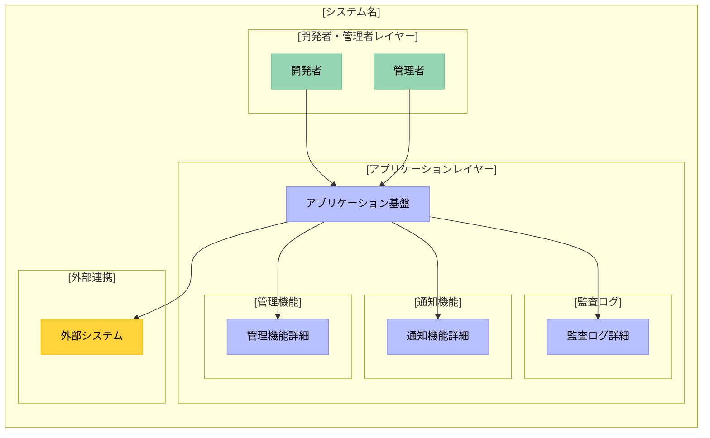
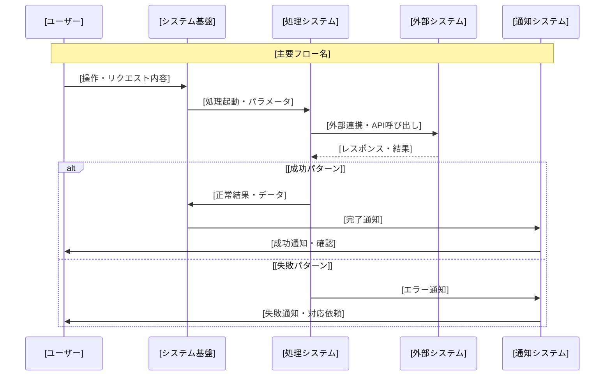

# /create-requirements

**Command Type**: System Architecture Requirements Generator  
**Domain**: IT Consulting Projects  
**Purpose**: 全体システム構成設計書の高品質自動生成

## Overview

ITコンサルティングプロジェクト向けの要件定義書を高品質に自動生成する汎用コマンド。提案書から技術実装レベルの詳細な要件定義書を生成し、実装可能な設計書を出力します。

**特徴**: 要件定義書を作成する前に、すべての不明点をユーザーに確認し、完全に解消してから高品質なドキュメントを生成します。

## Usage

```bash
/create-requirements <proposal_path> [deliverables_path]
```

### Parameters

| Parameter | Type | Description | Required | Example |
|-----------|------|-------------|----------|---------|
| `proposal_path` | File Path | 顧客提案書のファイルパス（.md） | Yes | `docs/prj-summary.md` |
| `deliverables_path` | File Path | 作成予定ドキュメント一覧のパス（.md） | No | `docs/作成予定ドキュメント一覧.md` |

## Processing Flow

### 1. 入力分析
- 提案書の構造・内容解析
- プロジェクト情報（背景・課題・目標・制約）の抽出
- 不明点・曖昧点の検出

### 2. 質問ファイル生成フェーズ

#### 質問ファイルの自動生成
提案書を分析し、確認が必要な項目を質問ファイルとして出力：
- **出力先**: `01_要件定義/requirements-questions.md`
- **形式**: Markdownテーブル形式（回答欄付き）
- **目的**: ユーザーが自分のペースで検討・回答可能

#### 質問項目の最適化原則
- **必須項目**: 15-20個程度に厳選（要件定義書作成に不可欠な最小限の情報）
- **推奨項目**: 提案書の内容に応じて必要なだけ生成（詳細設計に有用な情報）
- **提案書の具体性に応じた調整**: 技術方式が決まっている場合は実装に必要な項目のみ確認
- **重複排除**: 同様の内容を異なる観点から聞かない

#### 確認事項の分類（優先度順）
- **必須確認事項**: 要件定義書作成に不可欠な最小限の情報
  - 基本情報（プロジェクト名、組織、期間、体制）
  - 実装環境（AWS、GitHub等の具体的な設定）
  - 重要なリスク項目
- **推奨確認事項**: より詳細な設計のための情報
  - 運用方針（通知方法、承認フロー等）
  - パフォーマンス目標値
  - 連携システムの詳細
  - セキュリティ・コンプライアンス要件
  - プロジェクト固有の実装詳細

#### 動的質問生成（提案書の内容に基づく）
提案書を分析し、**既に決定済みの内容は質問しない**：

1. **基本情報確認**（必須・最小限）
   - 提案書から読み取れない必須情報のみ

2. **技術環境確認**（必須・実装に必要な具体値）
   - 既に方式が決まっている場合は設定値のみ確認

3. **運用・詳細設計確認**（推奨・必要に応じて）
   - プロジェクトに応じた詳細確認事項

4. **リスク確認**（必須・重要項目のみ）
   - プロトタイプ検証が必要な機能
   - 統合時の技術的懸念事項

### 3. 回答ファイル読み込み
- **入力**: `01_要件定義/requirements-questions.md`（回答済み）
- **処理**: 回答内容の解析と妥当性確認
- **検証**: 矛盾や不足の検出

### 4. 技術設計
- 実装レベルの詳細仕様への変換
- API/パラメータの具体化
- 既存システムとの依存関係把握
- ユーザー確認内容の反映

### 5. 要件設計
- システム特性分析（処理特性・負荷特性）
- 非機能要件の具体化（性能・可用性・セキュリティ）
- 監査・コンプライアンス要件の実装詳細

### 6. 視覚化
- Mermaid図による構成図・フロー図生成
- シーケンス図によるデータフロー表現

### 7. 品質保証
- 技術的不確実性の明記
- 実装可能性の検証
- ユーザー確認内容との照合

## Output Template

### Document Structure Overview

生成される要件定義書は以下の標準化された構造に従います：

```markdown
# [年月-番号-プロジェクト名]/01_要件定義/全体システム構成設計書

[Backlog Wiki Link](https://cm1.backlog.jp/alias/wiki/[ID])

## 1. 目的
本設計書は、[組織名]における[プロジェクト名]の全体システム構成を定義し、
[主要目標]の実現に向けた技術的アーキテクチャを明示するものです。

### 1.1 プロジェクト概要
- プロジェクトの背景・課題・新アプローチの説明

### 1.2 ビジネス要件と技術要件のバランス
- 開発者体験・セキュリティ・運用コストの最適化方針

### 1.3 関連文書への参照
- 関連する要件定義書への具体的参照リンク

## 2. 機能要件

### 2.1 [コア機能名1]
- **[サブ機能1名]**: [具体的な機能説明、実行条件、タイミング] + [具体的ツールチェーン]
- **[サブ機能2名]**: [具体的な機能説明、実行条件、タイミング] + [具体的ツールチェーン]
- **[サブ機能3名]**: [関連機能説明] + [具体的ツール名]
- **[サブ機能4名]**: [関連機能説明] + [具体的実行環境・ツール]

### 2.2 [コア機能名2]
- **[サブ機能1名]**: [具体的な機能説明] + [具体的ポリシー・設定]
- **[サブ機能2名]**: [具体的な機能説明] + [具体的API・プロセス]

### 2.3 [コア機能名3]
- **[サブ機能1名]**: [申請・検証・登録プロセス説明] + [具体的API・ツール]
- **[サブ機能2名]**: [管理項目詳細] + [具体的設定ファイル形式]
- **[サブ機能3名]**: [管理方式、権限制御] + [具体的ツール・設定]

### 2.4 通知機能
- **[通知タイプ1名]**: [トリガー条件、段階的通知方式] + [具体的通知チャネル・ツール]
- **[通知タイプ2名]**: [トリガー条件、即座通知方式] + [具体的通知方式・機能]
- **[通知タイプ3名]**: [トリガー条件、確認通知] + [具体的通知方式・確認方法]
- **[通知タイプ4名]**: [トリガー条件、監視通知] + [具体的通知機能・ツール]
- **[通知タイプ5名]**: [トリガー条件、緊急通知] + [複数チャネル通知方式・ツール]

### 2.5 権限管理機能
- **[アクセス制御機能名]**: [グループ・ロール別アクセス制御] + [具体的権限制御ツール・設定]
- **[ワークフロー保護機能名]**: [管理権限者限定編集機能] + [具体的保護設定・ツール]
- **[ブランチ保護機能名]**: [変更制限・レビュー必須化] + [具体的設定・ツール]
- **[レビュー・承認機能名]**: [承認フロー・ステータスチェック必須化] + [具体的設定・ツール]
- **[管理者権限機能名]**: [管理チームメンバー限定権限] + [具体的権限管理ツール]

### 2.6 監査・ログ機能
- **監査ログ**: [ログ種別] + [記録内容] + [保存先]
- **イベント記録**: [記録対象イベント] + [ログ形式] + [保持期間]
- **コンプライアンス対応**: [準拠規格] + [監査要件対応方法]

## 3. 非機能要件

### 3.1 性能要件

本システムは以下の特性により、[性能要件定義方針を記載]

#### 3.1.1 システム特性
- **[処理特性1]**: [バッチ処理中心/リアルタイム処理/非同期処理等のシステム特性]
- **[処理特性2]**: [アクセス頻度特性/処理量特性/同時実行特性等]
- **[許容特性]**: [待機時間許容度] + [品質と処理時間の優先度関係]

#### 3.1.2 性能管理方針
- **[管理方針1]**: [処理完了通知等による開発者体験の確保方針]
- **[管理方針2]**: [リソース監視とボトルネック特定方針]
- **[管理方針3]**: [ユーザーフィードバックに基づく継続改善方針]
- **[管理方針4]**: [運用開始後の実績に基づく要件設定方針]

### 3.2 可用性要件

#### 3.2.1 システム可用性方針
本システムは[依存するサービス群]に依存するため、各サービスの可用性に準拠する

- **[依存サービス1]**: [サービスの可用性SLAに準拠]
- **[依存サービス2]**: [サービスの可用性SLAに準拠]
- **[依存サービス3]**: [サービスの可用性SLAに準拠]

#### 3.2.2 運用体制
- **基盤インフラ監視**: [既存監視体制への依存方針]
- **システム運用保守**: [担当チームが以下を担当]
  - [システム固有機能1の監視・対応]
  - [システム固有機能2の運用保守]
  - [システム固有機能3の運用保守]
  - [システム固有エラーの監視・対応]
- **障害時対応**: [基盤サービス障害時は依存サービス復旧を待つ、システム固有障害時は担当チームが対応]

### 3.3 セキュリティ要件

#### 3.3.1 認証・認可
- **[認証システム]認証**: 既存の[認証システム名]に依存
- **[権限管理システム]認証**: 既存の[権限管理チーム]が提供する[認証手段]に依存

#### 3.3.2 データ保護
- **[データ暗号化]**: [暗号化サービス/システム]による[対象データ]の暗号化
- **[プラットフォーム保護]**: [プラットフォーム名]の標準的なデータ保護に依存
- **シークレット管理**: [シークレット管理システム1]/[シークレット管理システム2]による機密情報管理
- **アクセス制御**: [対象ログ]へのアクセスは既存認証システムに依存（上記、3.3.1 認証・認可を参照）

### 3.4 スケーラビリティ要件

本システムは主に[マネージドサービス群]を使用するため、スケーラビリティは各サービスに依存する

#### 3.4.1 スケーラビリティ対応
- **[サービス群]**: [マネージドサービス]の自動スケーリングに依存
- **[特定システム機能]**: [具体的なスケーリング設定項目]による[並列処理数調整]と[リソース制限調整]

### 3.5 運用性要件

#### 3.5.1 保守性
- **Infrastructure as Code**: [IaCツール]による設定管理
- **設定変更**: [プラットフォーム]にて上記[IaCツール]コードの変更管理を行う

### 3.6 コンプライアンス要件

#### 3.6.1 監査ログ機能
- 全ての操作イベントを自動的に記録し、監査要件に対応する
- 詳細なログ記録方式は下記「4.4 監査ログ実装詳細」を参照

## 4. 全体システム構成

### 4.1 システム構成概要

本システムは、機能要件・非機能要件に基づき、以下のコンポーネントで構成されます。



### 4.2 コンポーネント別役割

#### 4.2.1 [開発者・管理者レイヤー]
- **開発者**: [役割・操作内容・使用ツール・責任範囲]
- **管理者**: [管理業務・権限・監視運用・エスカレーション対応]

#### 4.2.2 [アプリケーションレイヤー]
- **[基盤システム名]**: [認証・基本機能・既存システム依存・運用体制]
- **[管理機能名]**: [管理機能・権限制御・承認フロー・自動化範囲]

### 4.3 通知機能実装詳細
- 実装方式、タイミング、注意事項

### 4.4 監査ログ実装詳細

#### 4.4.1 [ログ種別1]
- **実装方式**: [ログ記録技術] + [変更履歴管理]
- **記録内容**: [対象・変更内容] + [メタデータ]
- **保存場所**: [保存システム] + [永続性]
- **改ざん対策**: [技術的保護措置] + [制限事項・追加対策必要性]
- **注意事項**: [技術的制約] + [厳密な監査要件時の検討事項]

#### 4.4.2 [ログ種別2]
- **実装方式**: [複数システム連携] + [ログ統合管理]
- **記録内容**: [実行ログ・結果] + [タイムスタンプ・実行者]
- **保存場所**: [保存システム1: 保持期間] + [保存システム2: 保持期間]
- **推奨**: [監査要件に応じた保持期間延長検討]

### 4.5 データフロー詳細



### 4.6 実装詳細

#### 4.6.1 [主要機能名]実装詳細
- **実装方式**: [技術実装] + [設定管理] + [外部依存関係]
- **設定・パラメータ**: [設定項目: 設定値・説明・制限事項]
- **メリット**: [実装方式の利点] + [運用・保守面の利点]
- **注意事項**: [技術的制約・依存関係] + [詳細検証が必要な項目]

## 5. プロジェクトを進めるうえでのリスク

### 5.1-5.2 技術的リスク・統合リスク
- 実現可能性の不明確な要素と対策

### 5.3 パフォーマンスリスク
- 性能目標達成の不確実性

### 5.4 プロトタイプ検証推奨事項
- 早期検証が必要な機能（表形式）
- 段階的実装推奨機能
- 代替案の準備が必要な領域

### 5.5-5.9 リスク管理
- リスク軽減アクション
- ビジネス・要件リスク
- リソース・体制リスク
- 外部要因リスク
- リスク対応計画とエスカレーション
```

### Template Variables

主要な変数は提案書の内容から自動的に抽出されます：

| Variable | Description | Example |
|----------|-------------|---------|
| `[年月-番号-プロジェクト名]` | プロジェクト識別子 | `202408-001-Web3TodoApp` |
| `[組織名]` | 実施組織 | `株式会社Example` |
| `[主要目標]` | プロジェクトの主目的 | `開発者体験の向上` |
| `[コア機能名]` | 機能要件 | `CI/CD管理機能` |

## Quality Standards

### 文書品質基準
- **完全性**: 全必須セクションの網羅
- **技術的正確性**: API・設定値の正確な記載
- **実装可能性**: 技術的制約の妥当性確認
- **運用観点**: 監視・保守・障害対応の考慮

### 生成ルール
1. ユーザー確認優先（不明点の事前解消）
2. 実装レベルの具体性（API名・設定値の明記）
3. 技術的不確実性の明記
4. 既存システム依存の明確化
5. 現実的なシステム特性分析
6. リスクとプロトタイプ検証の詳細化

## Usage Example

### Step 1: コマンド実行
```bash
/create-requirements docs/proposal.md
```

### Step 2: 質問ファイル生成
システムが提案書を分析し、質問ファイルを生成：
```
✅ 質問ファイルを生成しました: 01_要件定義/requirements-questions.md
📝 ファイル内の質問に回答を記入してください
```

### Step 3: ユーザー回答
ユーザーが質問ファイルに回答を記入：
- 各質問の「回答」欄に情報を入力
- チーム内で確認・レビュー可能
- 不明な項目は「未定」「検討中」等でも可

### Step 4: 要件定義書生成
回答済みファイルを読み込み、要件定義書を生成：
```bash
# 再度実行すると回答ファイルを読み込む
/create-requirements docs/proposal.md
```

## Question File Template

### 生成される質問ファイルの形式

```markdown
# 要件定義書作成のための確認事項

生成日時: [YYYY-MM-DD HH:MM]
提案書: [proposal_path]

## 回答方法
各セクションの表内「回答」欄に情報を記入してください。
不明な場合は「未定」「検討中」等を記入し、備考欄に詳細を記載してください。

## 1. 基本情報（必須）

| 項目 | 質問 | 回答 | 備考 |
|------|------|------|------|
| プロジェクト名 | 正式なプロジェクト名を教えてください | | |
| 組織名 | 実施組織の正式名称を教えてください | | |
| 開発期間 | 開発開始日と終了予定日を教えてください | | |
| 体制 | 開発チームの人数と役割分担を教えてください | | |

## 2. 技術詳細（必須）

| 項目 | 質問 | 回答 | 備考 |
|------|------|------|------|
| プラットフォーム | 使用するクラウド/インフラを教えてください（AWS/Azure/GCP/オンプレ等） | | |
| 主要言語 | 使用する主要なプログラミング言語を教えてください | | |
| フレームワーク | 使用予定のフレームワークを教えてください | | |

## 3. 非機能要件（推奨）

| 項目 | 質問 | 現在の想定 | 目標値 | 備考 |
|------|------|------------|--------|------|
| レスポンスタイム | APIの目標応答時間を教えてください | | | |
| 同時接続数 | 想定される最大同時接続数を教えてください | | | |
| 可用性 | システムの稼働率目標を教えてください（例：99.9%） | | | |

## 4. リスクと懸念事項（必須）

| カテゴリ | 質問 | 回答 | 対策案 |
|----------|------|------|--------|
| 技術的リスク | 実現可能性に不安がある技術要件はありますか？ | | |
| 要件リスク | 要件が不明確または変更可能性がある機能はありますか？ | | |
| リソースリスク | 必要なスキルを持つ人材確保に懸念はありますか？ | | |
| 外部依存 | 外部システムやベンダーへの依存で懸念される点はありますか？ | | |
| プロトタイプ | 事前にプロトタイプ検証が必要な機能はありますか？ | | |

## 5. プロジェクト固有の確認事項

[提案書の内容に基づいて動的に生成される質問]

| 項目 | 質問 | 回答 | 備考 |
|------|------|------|------|
| [項目名] | [具体的な質問] | | |
```

## Output Files

### 生成ファイル一覧

1. **質問ファイル**: `01_要件定義/requirements-questions.md`
   - Format: Markdown（テーブル形式）
   - Size: ~10KB
   - Purpose: ユーザー回答収集

2. **要件定義書**: `01_要件定義/全体システム構成設計書.md`
   - Format: Markdown (UTF-8)
   - Size: ~50KB
   - Sections: 5 Major sections

**Note**: このコマンドはファイルベースの確認プロセスを通じて高品質な技術文書を生成します。質問ファイルにより、チームでの検討やレビューが可能になり、より正確で完全な要件定義書を作成できます。