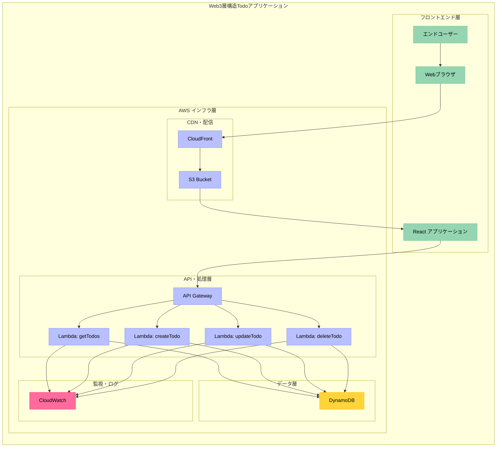
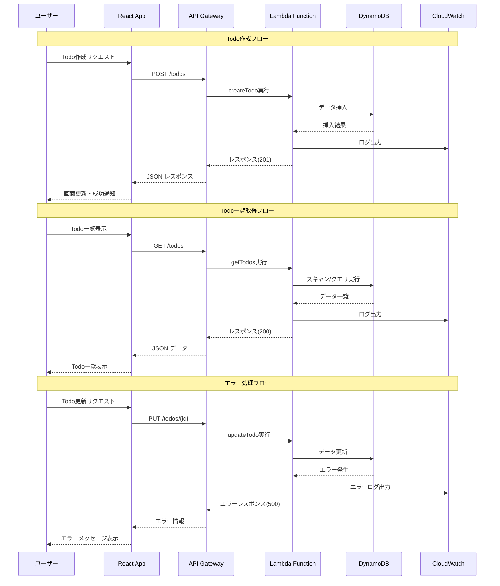

# 202510-001-Test/01_要件定義/全体システム構成設計書

## 1. 目的

本設計書は、a株式会社におけるTestプロジェクトの全体システム構成を定義し、Web3層構造Todoアプリケーションの実現に向けた技術的アーキテクチャを明示するものです。

### 1.1 プロジェクト概要

AWS上でのシンプルなWeb3層構造Todoアプリケーション開発により、モダンなサーバーレスアーキテクチャとTerraformによるInfrastructure as Code（IaC）を活用し、スケーラブルで保守性の高いシステムの構築を目指します。

### 1.2 ビジネス要件と技術要件のバランス

- **開発効率**: 小規模チーム（開発1名、インフラ1名）での効率的な開発
- **運用コスト**: 従量課金によるコスト最適化
- **技術学習**: React/サーバーレス技術の習得と実用化

### 1.3 関連文書への参照

- 提案書: docs/summary.md
- 質問回答書: 01_要件定義/requirements-questions.md

## 2. 機能要件

### 2.1 Todo基本管理機能

- **Todo作成**: ユーザーが新規Todoアイテムを作成できる機能 + REST API (POST /todos)
- **Todo一覧表示**: 登録されたTodoアイテムの一覧を表示する機能 + REST API (GET /todos)
- **Todo更新**: 既存のTodoアイテムの内容・ステータスを更新する機能 + REST API (PUT /todos/{id})
- **Todo削除**: 不要なTodoアイテムを削除する機能 + REST API (DELETE /todos/{id})

### 2.2 ユーザーインターフェース機能

- **レスポンシブWebUI**: React による現代的なSPA + モバイル・デスクトップ対応
- **リアルタイム更新**: API実行結果の即座反映 + 楽観的UI更新
- **エラーハンドリング**: 適切なエラーメッセージ表示 + ユーザビリティ向上

### 2.3 将来拡張機能（オプション）

- **期限管理**: Todo項目への期限設定機能 + アラート通知
- **優先度設定**: 重要度による分類・ソート機能 + UI表示
- **カテゴリ分類**: ラベル・タグによる分類機能 + フィルタリング

### 2.4 システム基盤機能

- **API認証**: 将来の認証システム連携に対応 + JWT/OAuth2対応準備
- **データ検証**: 入力データの妥当性チェック + セキュリティ対策
- **ログ出力**: システム動作・エラーの記録 + CloudWatchへの出力

## 3. 非機能要件

### 3.1 性能要件

本システムは小規模利用を前提とした軽量なTodoアプリケーションとして、実用的な応答性能を確保します。

#### 3.1.1 システム特性

- **処理特性**: リクエスト/レスポンス型のWeb API処理
- **負荷特性**: 個人・小チーム利用想定（同時接続数 100-500ユーザー）
- **許容特性**: Lambda cold startを考慮した現実的な応答時間設定

#### 3.1.2 性能管理方針

- **応答時間目標**: API応答時間 2秒以内（cold start含む）、フロントエンド初期ロード 3秒以内
- **スケーラビリティ**: AWSマネージドサービスの自動スケーリングに依存
- **性能監視**: CloudWatchメトリクスによる継続的な性能監視
- **改善方針**: 運用開始後の実績データに基づく継続的な性能改善

### 3.2 可用性要件

#### 3.2.1 システム可用性方針

本システムはAWSマネージドサービスに依存するため、各サービスの可用性に準拠する

- **AWS Lambda**: 99.95% SLA準拠
- **Amazon DynamoDB**: 99.99% SLA準拠  
- **API Gateway**: 99.95% SLA準拠

#### 3.2.2 運用体制

- **基盤インフラ監視**: AWSの標準監視体制に依存
- **システム運用保守**: プロジェクトチームが以下を担当
  - アプリケーション固有エラーの監視・対応
  - 機能追加・修正の運用保守
  - ユーザーサポート・問い合わせ対応
- **障害時対応**: AWS基盤障害時はサービス復旧を待機、アプリケーション固有障害時はチームが対応

### 3.3 セキュリティ要件

#### 3.3.1 認証・認可

- **現段階**: 認証機能は未実装（将来対応予定）
- **将来対応**: 既存認証システムとの連携を想定

#### 3.3.2 データ保護

- **通信暗号化**: HTTPS通信の必須化
- **データ暗号化**: DynamoDB encryption at rest による保存データの暗号化
- **シークレット管理**: API設定情報のAWS Systems Manager Parameter Store管理
- **アクセス制御**: IAMによる最小権限の原則に基づくアクセス制御

### 3.4 スケーラビリティ要件

本システムは主にAWSマネージドサービスを使用するため、スケーラビリティは各サービスに依存する

#### 3.4.1 スケーラビリティ対応

- **Lambda関数**: AWS Lambdaの自動スケーリングに依存（同時実行数1000まで）
- **DynamoDB**: Auto Scalingによる読み取り・書き込みキャパシティの自動調整

### 3.5 運用性要件

#### 3.5.1 保守性

- **Infrastructure as Code**: Terraformによる設定管理
- **設定変更**: GitHubにてTerraformコードの変更管理を行う

### 3.6 コンプライアンス要件

#### 3.6.1 監査ログ機能

- 全ての操作イベントを自動的にCloudWatchに記録し、基本的な監査要件に対応する
- 詳細なログ記録方式は下記「4.4 監査ログ実装詳細」を参照

## 4. 全体システム構成

### 4.1 システム構成概要

本システムは、機能要件・非機能要件に基づき、以下のコンポーネントで構成されます。

### 4.2 コンポーネント別役割

#### 4.2.1 フロントエンド層

- **エンドユーザー**: Webブラウザを通じてTodo管理操作を実行
- **React アプリケーション**: SPA による直感的なユーザーインターフェース、API連携、状態管理

#### 4.2.2 AWS インフラ層

- **CloudFront + S3**: 静的コンテンツ配信・グローバルCDN・HTTPS終端・レスポンシブ対応
- **API Gateway**: REST APIエンドポイント・CORS対応・レート制限・リクエスト検証
- **Lambda関数群**: サーバーレス処理・CRUD操作・ビジネスロジック・自動スケーリング

### 4.3 データモデル実装詳細

#### 4.3.1 DynamoDBテーブル設計

- **テーブル名**: Todos
- **プライマリキー**: id (String)
- **属性**: title, description, status, createdAt, updatedAt
- **キャパシティ設定**: On-demand billing mode

### 4.4 監査ログ実装詳細

#### 4.4.1 アプリケーションログ

- **実装方式**: Lambda関数内での構造化ログ出力 + CloudWatch Logs自動収集
- **記録内容**: API実行ログ・エラー情報・実行時間 + リクエストID・タイムスタンプ
- **保存場所**: CloudWatch Logs + 標準保持期間（30日）
- **改ざん対策**: CloudWatch Logsの標準的な保護機能 + 必要に応じてログ暗号化検討
- **注意事項**: 個人情報の誤ログ出力防止 + 本格運用時のログ保持期間再検討

#### 4.4.2 インフラログ

- **実装方式**: AWS X-Ray トレーシング + API Gateway アクセスログ
- **記録内容**: API実行トレース・パフォーマンス情報 + HTTP アクセス履歴
- **保存場所**: X-Ray サービス（30日） + CloudWatch Logs（30日）
- **推奨**: 監査要件に応じたログ保持期間の延長検討

### 4.5 データフロー詳細

### 4.6 実装詳細

#### 4.6.1 Lambda関数実装詳細

- **実装方式**: Node.js Runtime 20.x + AWS SDK v3 + 関数別デプロイ
- **設定・パラメータ**: メモリ128MB・タイムアウト30秒・環境変数による設定管理
- **メリット**: 従量課金によるコスト効率・自動スケーリング・管理不要インフラ
- **注意事項**: Cold start対策（Provisioned Concurrency検討）・VPC設定による性能影響回避

## 5. プロジェクトを進めるうえでのリスク

### 5.1 技術的リスク（高優先度）

**Lambda特有の考慮事項不明**
- **リスク内容**: Cold start時間・実行時間制限・メモリ制限・同時実行制限の理解不足
- **影響度**: 性能要件未達・開発遅延
- **対策**: プロトタイプ検証による早期性能確認・AWS公式ドキュメント学習

### 5.2 パフォーマンスリスク（中優先度）

**Lambda性能チューニング手法不明**
- **リスク内容**: Cold start対策・メモリ設定・DynamoDBキャパシティ設定の最適化手法不足
- **影響度**: ユーザー体験低下・運用コスト増大
- **対策**: 段階的負荷テスト実施・CloudWatch監視による継続改善

### 5.3 スキル・リソースリスク（中優先度）

**React経験不足**
- **リスク内容**: フロントエンド開発の遅延・品質問題
- **影響度**: 開発スケジュール遅延・保守性低下
- **対策**: 学習期間の確保・プロトタイプによる技術習得

### 5.4 プロトタイプ検証推奨事項

早期検証により技術的リスクを軽減し、実装可能性を確認します。

| 検証項目 | 優先度 | 期間 | 検証目的 | 成功条件 |
|----------|--------|------|----------|----------|
| Lambda性能検証 | 高 | 1-2日 | Cold start時間・応答性能確認 | API応答時間2秒以内達成 |
| React統合検証 | 高 | 2-3日 | フロントエンド・API統合確認 | CRUD操作の正常動作確認 |
| DynamoDB設計検証 | 中 | 1日 | データモデル・性能妥当性確認 | 想定負荷での正常動作 |
| Terraform検証 | 低 | 1-2日 | IaC適用可能性確認 | 自動デプロイの成功 |

### 5.5 リスク軽減アクション

- **技術学習**: AWS公式トレーニング・ハンズオン実施
- **段階的実装**: MVP→機能追加の段階的開発アプローチ
- **継続監視**: 運用開始後のメトリクス監視・改善サイクル確立

### 5.6 要件・ビジネスリスク

**要件変更リスク**: 現時点では大きな要件変更予定はない
**予算・スケジュールリスク**: 小規模チームでの開発期間（2025/10-2025/12）は妥当

### 5.7 外部依存リスク

**AWSサービス依存**: マネージドサービス利用によりベンダーロックインが発生するが、学習・運用コスト削減効果が上回ると判断

### 5.8 リスク対応計画

**エスカレーション**: 技術的課題発生時は先方担当者への即座報告・代替案検討
**緊急時対応**: 重大障害時はAWSサポート活用・バックアップからの復旧手順整備

---

本要件定義書は、提供された情報を基に作成されました。詳細な技術検証・プロトタイプ実装を通じて、継続的に内容を精緻化していく予定です。